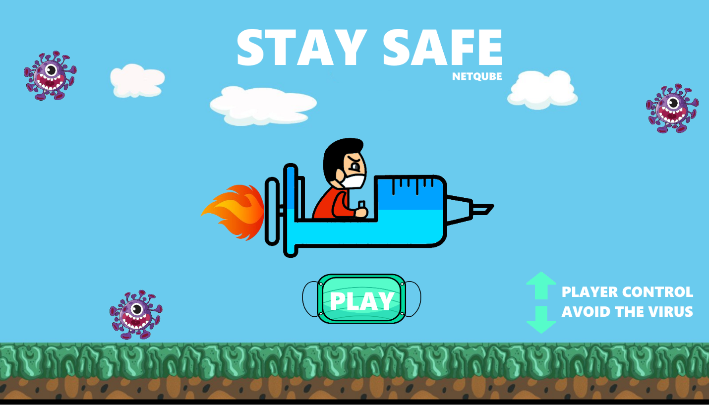

## Hi there 

Welcome to my page! 
I'm Philip, Fullstack developer from Switzerland. I'm working on web-projects, learning some new dishes and flippinh some NFTs. 
  

### Things I Code With

 
 
 
 
 
 
 
 
 
 
  

If you're here to pass your time, why not give [staysafe](https://netqube.itch.io/corona-runner) a try?

### A Few Quick Facts
<li>🔭 I’m currently working on <a href="https://netqube.ch">Netqube</a>.</li>
<li>🧐 Learning about frontend engineering with <strong>Angular</strong>, <strong>NoSQL</strong>, and a bit of <strong>dApps</strong>.</li>
<li>👨‍💻 Few of my projects are accessible on GitHub <a href="https://github.com/Netqube">Github</a>.</li>
<li>📝 I regulary write articles on <a href="https://netqube.ch">Blog</a>.</li>
<li>💬 Ping me about <strong>reactivex, solidity and blockchain stuff</strong>.</li>
<li>🎉 Fun Fact: I would never get tired of listening to ASH</li>
  

### Latest Posts on Netqube

<li>💬 Data vizualisation with D3 <a href="https://netqube.ch">Post</a>.</li>
<li>💬 Get paid in crypto <a href="https://netqube.ch">Post</a>.</li>
<li>💬 Build a Blockchain App (dApp) <a href="https://netqube.ch">Post</a>.</li>
  

### Where To Find Me

  
 
 
  

© 2022 GitHub, Inc.
Terms
Privacy
Security
Status
Docs
Contact GitHub
Pricing
API
Training
Blog
About
